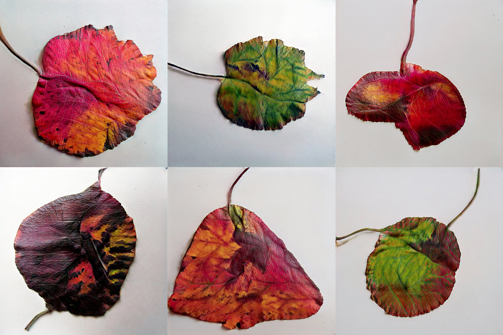
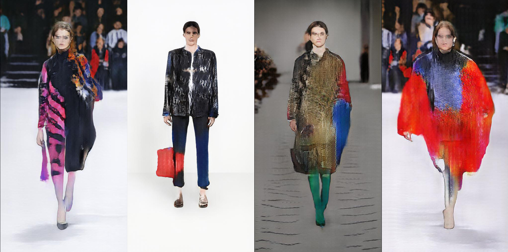
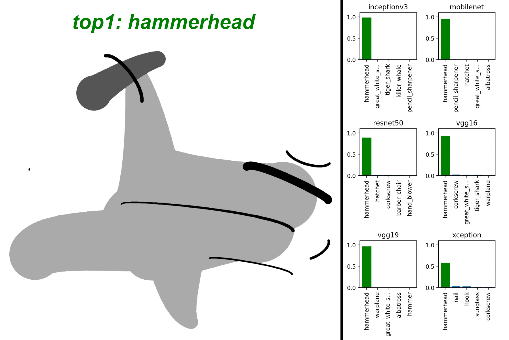
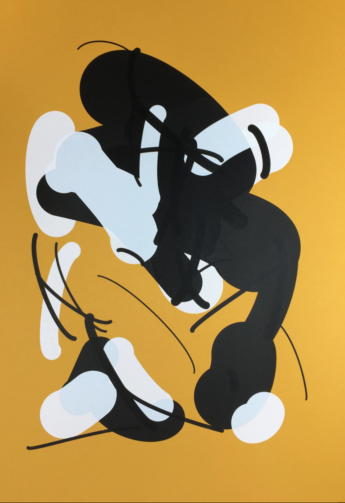
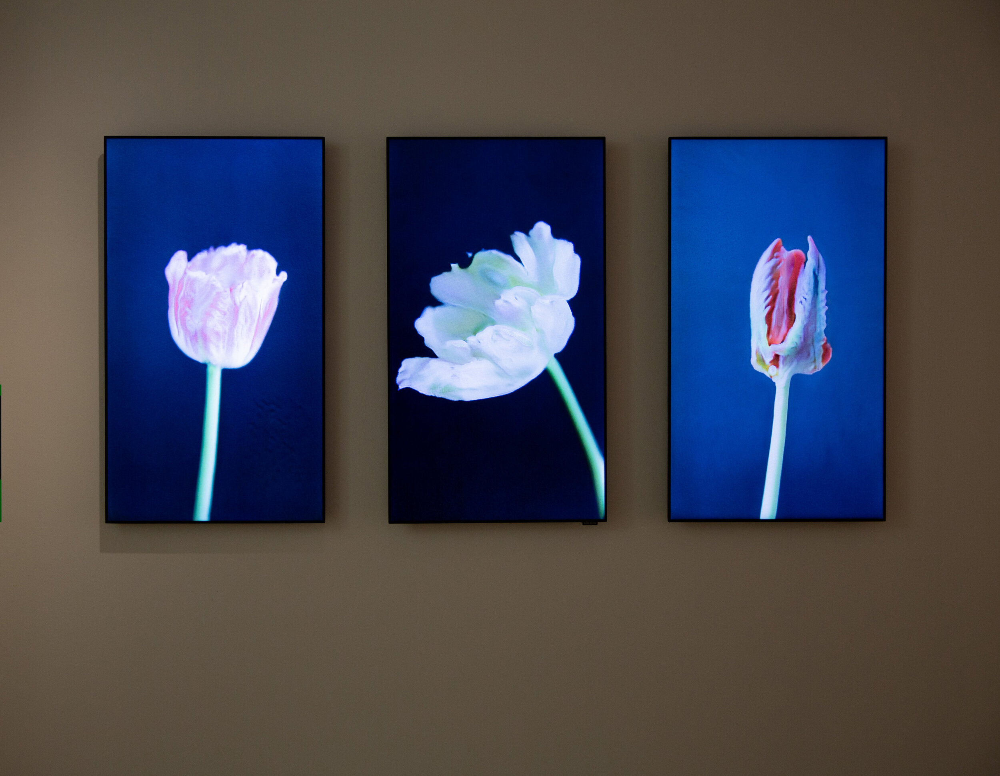
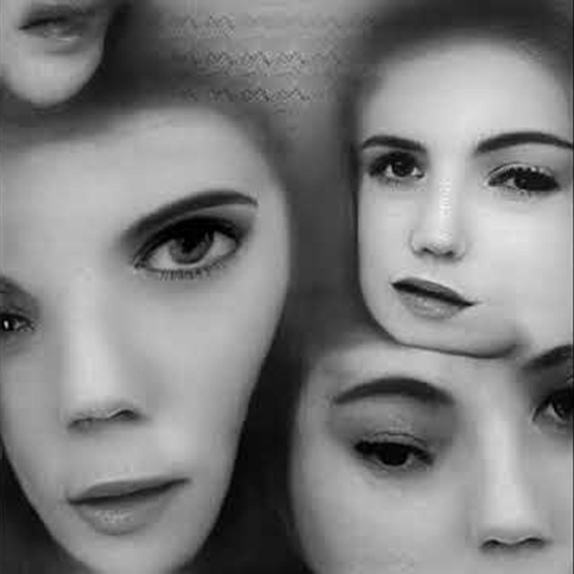
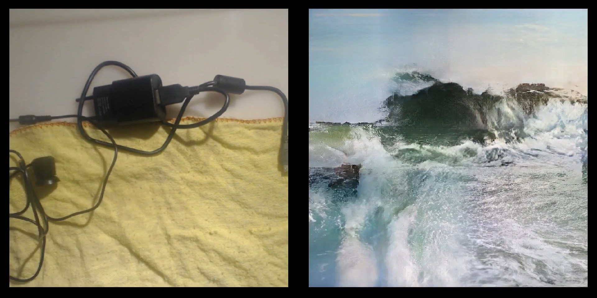
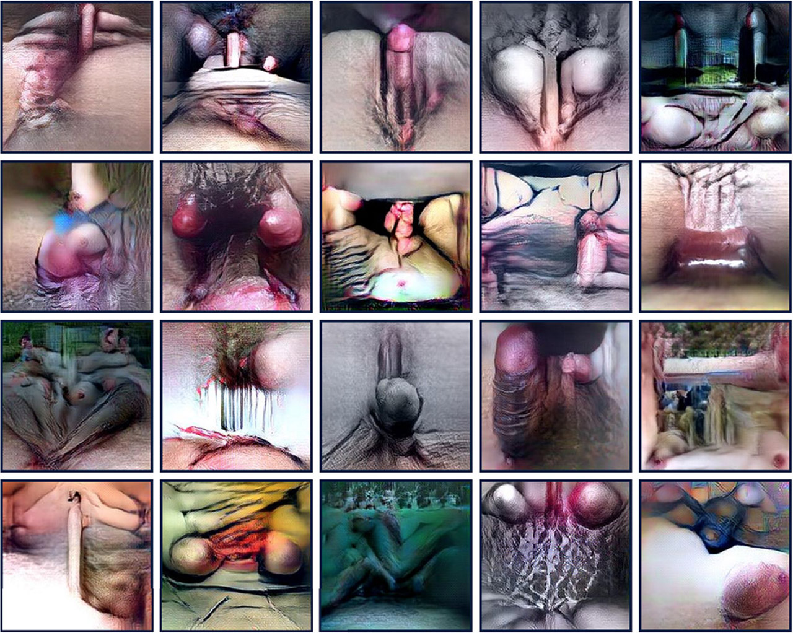
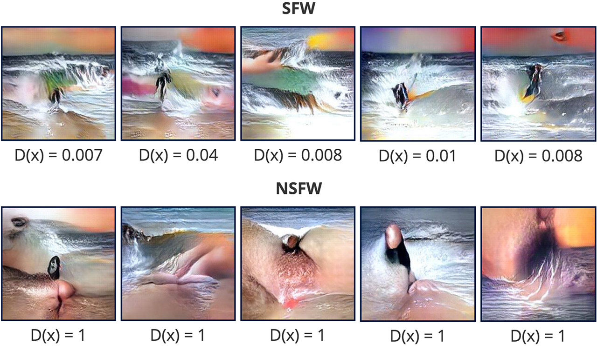

# A Brief Survey of Convolutional Neural Nets (CNNs) and Generative Adversarial Networks (GANs) in Art

As with 'traditional' generative art (e.g. Vera Molnár), artists using machine learning (ML) continue to develop programs that render an infinite variety of forms, and these forms are still characterized (or parameterized) by variables. What’s interesting about the use of ML in the arts, is that the values of these variables are no longer specified by the artist. Instead, the variables are now *deduced indirectly* from the training data that the artist provides. As Kyle McDonald has pointed out, machine learning is *programming with examples, not instructions*.

The use of ML typically means that the artists' new variables control *perceptually higher-order properties*. (The parameter space, or number of possible variables, may also be significantly larger.) The artist’s job becomes one of selecting or creating training sets, and deftly controlling the values of the neural networks’ variables. 

### Helena Sarin, [*Leaves*](https://twitter.com/glagolista/status/1089157286684184576) (2018)

Helena Sarin has trained a [Generative Adversarial Network](https://www.youtube.com/watch?v=ZRgwcMqxhPw) on images of leaves. As with feedback between counterfeiters and authorities, Sarin's generator attempts to synthesize a leaf-like image; the discriminator then attempts to determine whether or not it is a real image of a leaf. Using evaluative feedback from the discriminator, the generator improves its fakes, eventually creating such good leaves that the discriminator can't tell real from fake. 

(Incidentally, it's also possible to generate music this way. For example, here is [*Relentless Doppelganger*](https://www.youtube.com/watch?v=MwtVkPKx3RA) by DADABOTS (CJ Carr and Zack Zukowski), an infinite live stream of generated death metal.)

### Robbie Barrat, [*Neural Network Balenciaga*](https://robbiebarrat.github.io/oth/bale.html) (2018)

Where Helena Sarin has been training networks with collections of leaves, Robbie Barrat has been training them with fashion lines from Balenciaga. Barrat uses a corpus of images from Balenciaga runway shows and catalogues, to generate outfits which are novel but at the same time heavily inspired by Balenciaga’s recent fashion lines. Barrat points out that his network lacks any contextual awareness of the non-visual functions of clothing (e.g. why people carry bags, why people prefer symmetrical outfits) - and thus produces strange outfits that completely disregard these functions — such as a pair of pants with a wrap-around bag attached to the shin, and a multi-component asymmetrical coat including an enormous blue sleeve. 

### Tom White, [*Synthetic Abstractions*](https://drib.net/)

Tom White’s *Synthetic Abstractions* series are seemingly innocent images, generated from simple lines and shapes, which trick algorithms into being classified as something else. Above is an arrangement of 10 lines which fools six widely-used classifiers into being perceived as a hammerhead shark, or an iron. Below this is a silkscreen print, “Mustard Dream”, which White explains is flagged as "Explicit Nudity" by Amazon Web Services, "Racy" by Google SafeSearch, and "NSFW" by Yahoo. White’s work is “art by AI, for AI”, which helps us see the world through the eyes of a machine. He writes: “My artwork investigates the Algorithmic Gaze: how machines see, know, and articulate the world. As machine perception becomes more pervasive in our daily lives, the world as seen by computers becomes our dominant reality.” This print literally *cannot be shown* on the internet; taking a selfie in his gallery may get you banned from Instagram. 

### Janelle Shane, [GANcats](https://aiweirdness.com/post/182633984547/gancats) (2019)

It’s worth pointing out that when training sets are too small, the synthesized results can show biases that reveal the limits to the data on which it was trained. For example, above are results from a network, trained by artist-researcher Janelle Shane, that synthesizes 'realistic' cats. But many of the cat images in the training dataset were from memes. And some cat images contain people... but not enough examples from which to realistically synthesize one. Janelle Shane points out that cats, in particular, are also highly variable. When the training sets can’t capture that variability, other misinterpretations show up as well. 

### Anna Ridler, [*Mosaic Virus*](http://annaridler.com/mosaic-virus) (2018)

Anna Ridler's real-time video work shows a tulip blooming, whose appearance is controlled by the trading price of Bitcoin. Ridler writes that "getting an AI to 'imagine' or 'dream' tulips echoes 17th century Dutch still life flower paintings which, despite their realism, are 'botanical impossibilities'".

#### Mario Klingemann, [*Face Feedback III*](https://www.youtube.com/watch?v=5h4R959O0cY)

Klingemann puts a generative adversarial network into feedback with itself. 

#### Memo Akten, [Learning to See](https://www.memo.tv/portfolio/learning-to-see/) (2017)

Akten uses input from a webcam to shape the response from a GAN, as it tries its hardest to replicate the camera view given what it has learned about images. 

#### Move Lab, [*Beat the Traffic*](https://www.move-lab.com/project/beatthetraffic/newyork/level/1/)

In this mini-game by Benedikt Groß et al., CNNs have been used to detect vehicles. 

---

### Some Art-Adjacent ML Research

*Research results produced by computer scientists that would require only a tiny nudge to become really interesting artworks.*

* [Few-Shot Video-to-Video Synthesis](https://nvlabs.github.io/few-shot-vid2vid/): puppeteering of [famous paintings](https://twitter.com/roadrunning01/status/1188467673333673984) and [sculptures](https://twitter.com/roadrunning01/status/1188467338741456896). Ting-Chun Wang et al. 

* Gabriel Goh, [*Image Synthesis from Yahoo's open_nsfw*](https://open_nsfw.gitlab.io/)

Detecting pornography is a major challenge for Internet hosts and providers. To help, Yahoo released an open-source classifier, open_nsfw, which rates images from 0 to 1. Gabriel Goh, a PHD student at UC Davis, wanted to understand this tool better. He started by using a neural network to synthesize some “natural-looking” images, shown in the bottom row, using white noise as a starting point. He then used a generative adversarial technique to maximally activate certain neurons of the Yahoo classifier, what he called “neural-net guided gradient descent”. Goh’s program basically asked, in many iterative steps, “how would this image need to change if it were to look slightly more like pornography?”

The result is a remarkable study in the abstract depiction of nudity. In short, Goh’s machine makes images that another machine believes are porno. These images are clearly not safe for work, but it’s difficult, or humorous perhaps, to say why. From the standpoint of conceptual art, this is really extraordinary. 

Not only is it possible to synthesize images which maximally activate the porn-detecting neurons, it is also possible to generate images “whose activations span two networks”. Goh bred these images to be recognized as “beach” scenes by the *places_CNN* network ... and then generated the bottom row, which activates detectors in both *places_CNN* and *open_NSFW*. Goh explains that these images fascinate him because “they are only seemingly innocent. The NSFW elements are all present, just hidden in plain sight. Once you see the true nature of these images, something clicks and it becomes impossible to unsee.”

---

### Some Technical Explanations of CNNs

* Gene Kogan, [*What convolutional neural networks see*](https://www.youtube.com/watch?v=Gu0MkmynWkw) (YouTube)

* Jason Yosinski, [*Understanding Neural Networks Through Deep Visualization*](https://www.youtube.com/watch?v=AgkfIQ4IGaM) ([YouTube](https://www.youtube.com/watch?v=AgkfIQ4IGaM)) ([Web site](http://yosinski.com/deepvis))

