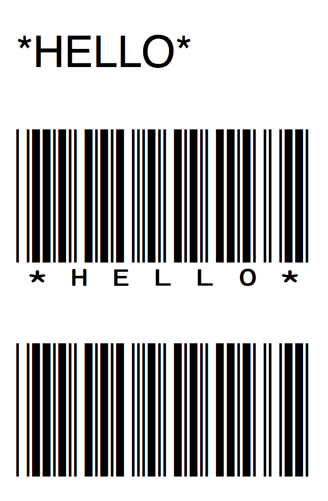

# Barcode Scanner Speed Project


---

### Overview

* Organize yourselves into two-person teams. 
* Each team will receive a barcode scanner. 
* You're also provided with barcode fonts, and some self-adhesive label paper. Feel free to use these, or any objects at your disposal that have barcodes. 
* Using any programming environment you prefer, create an interesting interaction with barcodes. 
* You have ~2, maybe 3 hours. If your idea outstrips your resources, make a speculative mockup. 
* Document your project in time for our next class session, and move on to other things. 

Viewing: [*Barcode DJs*](https://www.youtube.com/watch?v=n610IKQM4IA) (Jakub Pišek, Beata Kolbašovská, Erik Bartoš, 2017)

---

### Barcode Scanners

Your team will be provided with a [WoneNice USB Laser Barcode Scanner (Wired)](https://www.amazon.com/WoneNice-Barcode-Scanner-Handheld-Reader/dp/B00LE5VV1C/). 


Interestingly, barcode scanners are simply *keyboard emulators*. When you scan a barcode, the barcode image is translated into a sequence of letters and numbers, which your computer then receives as a sequence of (virtual) keypresses.

Barcode scanners are so ubiquitous that they are quite inexpensive. Most cost under $100, and ours costs $19.99. 

---

### Barcode Fonts

Here are some barcode fonts. Your mileage may vary: 

* [IDAutomationCode39.zip](barcode/IDAutomationCode39.zip) (*recommended*)
* [emwedo_bar-code-39.zip](barcode/emwedo_bar-code-39.zip)
* [azalea-software-inc_code39azalea.zip](barcode/azalea-software-inc_code39azalea.zip)

Feel free to use 'found' barcodes, too. 

---

### Properly Formed Barcodes

We are using [Code39 Barcodes](https://en.wikipedia.org/wiki/Code_39), an older format with wide compatibility. It represents 43 characters: all uppercase letters, numbers, and some special characters: 
```
ABCDEFGHIJKLMNOPQRSTUVW 1234567890 $% / + .- 
```

In plain text, barcodes must begin and end with an asterisk (*), as in: 

```
*HELLO*
```

Different barcode "fonts" may include (or not) a human-readable version of the encoded string. The image below shows the word `*HELLO*` encoded in three fonts. (*The 'H' in IDAutomationHC39M stands for 'Human Readable'.*)

* Helvetica
* IDAutomationHC39M
* IDAutomationSC39M_Demo




---

### Additional Items

Some things you may need:
* Laptop computer (any OS)
* USB extension cord (see the professor)
* Adhesive label sheets for laser printers
* Printer paper, scissors, scotch tape
* Things with barcodes on them.
