# LOOPS

 *Loop by [Skip Dolphin Hursh](http://www.skiphursh.com/Animated-GIFs-2014), 2014.* 

---

# Loops & Early Cinema: a Brief History

A great deal of early cinema was looping, from ~1824 until 1890. Let’s learn a little history about devices for early cinema devices. (Not covered here: non-looping systems like [magic lantern slideshows](https://en.wikipedia.org/wiki/Magic_lantern), [shadow puppetry](https://en.wikipedia.org/wiki/Wayang)...)

## Thaumatrope

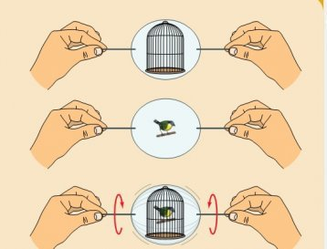

The invention of the [Thaumatrope](https://en.wikipedia.org/wiki/Thaumatrope), considered to be the first animation device, is usually credited to British physician John Ayrton Paris. Paris was said to have used one to demonstrate persistence of vision to the Royal College of Physicians in London in 1824. It consists of a disk with different images on each side; when spun quickly, persistence of vision fuses the images into a simple animated scene. 

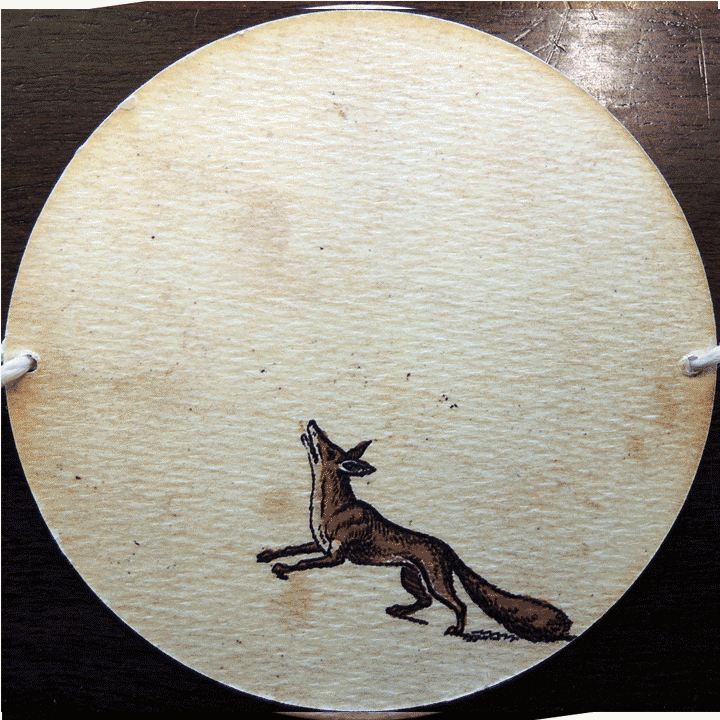

Below are some thaumatropes from the Richard Balzer collection: 

Interestingly, [there is evidence](https://jenmacnab.wordpress.com/tag/paleolithic-art/) that thaumatropes may have been a paleolithic invention. A number of bone discs have been found in the Dordogne region in France, dating to approximately 30,000 BCE. Long supposed to be buttons or decorative beads, archaeologists have proposed that these bone discs, all of which have a small hole bored through the centre, are in fact the earliest examples of thaumatropes. They reported: 

*"Given that some are decorated on both sides with animals shown in different positions, we realized that another type of use, relating to sequential animation, was possible. When a string is threaded through the central hole and the disc made to spin, “the animal goes down then gets back up in a fraction of a second and vice versa”. (Lorenzi, 2012)*

---

## Phenakistoscope

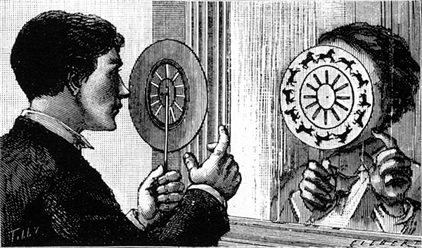

Invented by Belgian physicist Joseph Plateau in 1833, the **Phenakistoscope** is largely considered to be the first mechanism for true animation. Viewers looked at a sequence of images through a set of narrow slits on a spinning disk. [This article at Colossal](http://www.thisiscolossal.com/2013/10/the-first-animated-gifs/) shows a terrific collection of Phenakistoscopes. (*Thanks to Chris Jobson of Colossal for compiling these.*)

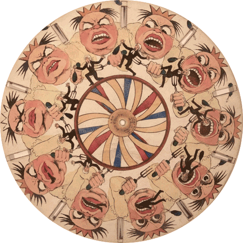

--- 

## Zoetrope & Praxinoscope

The **Zoetrope** was invented in 1834 by William George Horner. The Zoetrope is the third major optical device, after the Thaumatrope and Phenakistoscope, that uses the persistence of vision principle to create an illusion of motion.

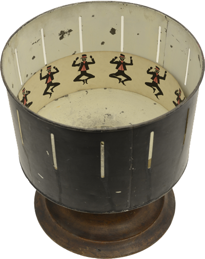

When the **Praxinoscope** was invented by Emile Reynaud in 1877, its mirrors offered a brighter image than the image seen through the Zoetrope’s slits, and interest in the Zoetrope soon declined.

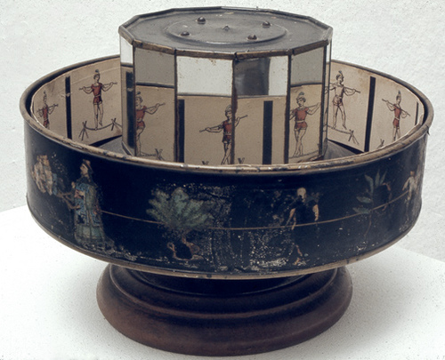

Here’s the difference:

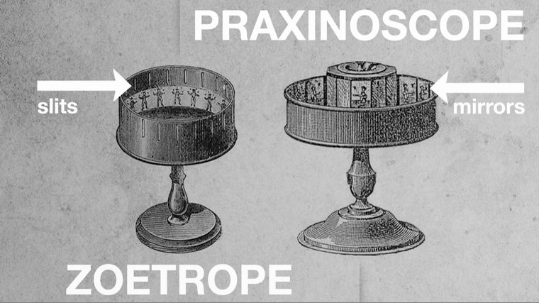

---

## Enter Chemical Film

Things got exciting with the invention of the gelatin emulsion by [Richard Leach Maddox](https://en.wikipedia.org/wiki/Richard_Leach_Maddox) (fast chemical photography) in 1871 – and soon thereafter, [chronophotography](https://en.wikipedia.org/wiki/Chronophotography), in the mid-1870s. Suddenly devices like the Zoetrope could depict movement with *photographic* media, and not just hand-drawn animations.

 
*[Eadweard Muybridge](https://en.wikipedia.org/wiki/Eadweard_Muybridge#Stanford_and_horse_gaits), Horse Gallop, 1878*

The invention of celluloid film in the late 1880s (which allowed for narrative films with durations of multiple minutes) led to the Edison lab's development of the **Kinetoscope** in 1889, an early single-viewer cinema system:

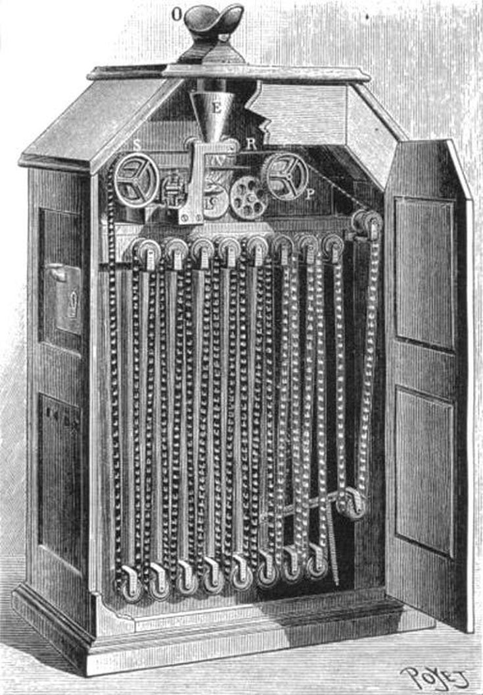

The [**Mutoscope**](https://en.wikipedia.org/wiki/Mutoscope) was another early motion picture viewer, patented by W.K.L. Dickson and Herman Casler in 1894. It used a loop of printed cards, like a rolodex-flipbook. Cheaper and simpler than the Kinetoscope, the Mutoscope quickly dominated the coin-in-slot peep-show business. 
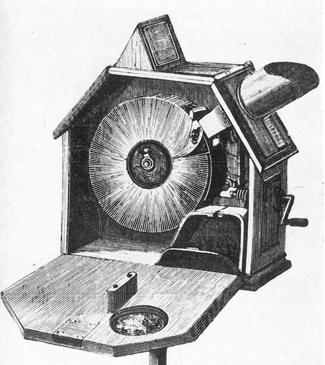

Here's a [Mutoscope peepshow](https://www.youtube.com/watch?v=8MS-2oZys6U&t=0m9s) [SFW-ish]: 
[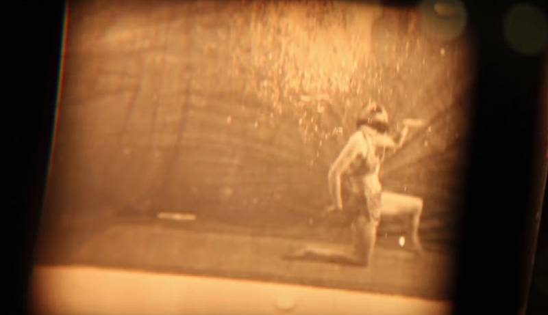](https://www.youtube.com/watch?v=8MS-2oZys6U&t=0m9s)

---

## Loops in Animation

Loops such as walk cycles remained a popular strategy for conserving effort and (stretching the duration) in animation. 

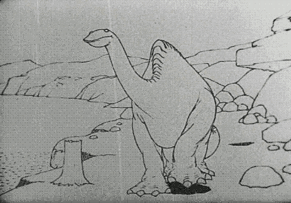 
[*Gertie the Dinosaur*](https://www.youtube.com/watch?v=TGXC8gXOPoU) (Winsor McCay, 1914) — the first film to use animation techniques such as keyframes, registration marks, tracing paper, the Mutoscope action viewer, and animation loops. 

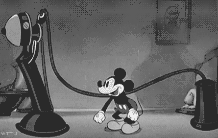

Loops evolved from simple actions (like walk cycles) to entire passages: 

For some artists, the loop is the whole story, and not just part of one. [Anna Firth](https://www.annafirth.com/ghost-loops/) is a contemporary Vancouver-based visual artist who creates animated loops.

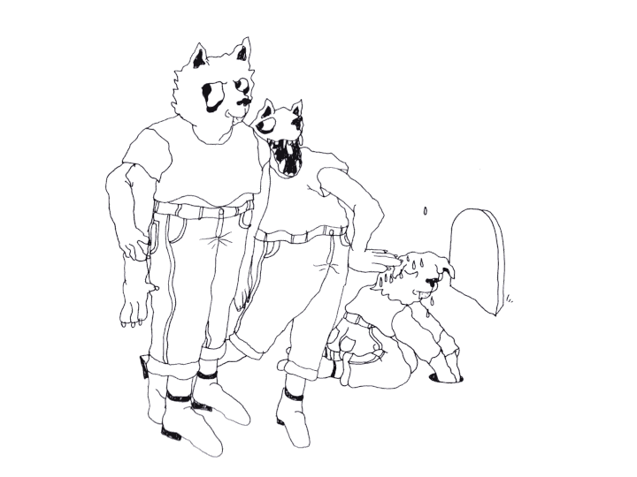

---

## Some Looping Art

Physical Cinema: Loops on Physical Things:

[Embroidered turntable animations](http://www.thisiscolossal.com/2015/07/fantastic-embroidered-zoetrope-animations-on-turntables-by-elliot-schultz/) by Elliot Schultz: 
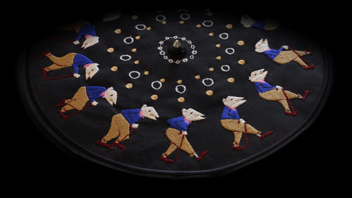

French director and animator Alexandre Dubosc creates [zoetrope chocolate cakes](https://www.thisiscolossal.com/2015/10/andre-duboscs-newest-animated-zoetrope-cake-melting-pop/): 

Computer modeling/printing can also play a role. Here, [Stroboscopic loops on Easter eggs](http://www.thisiscolossal.com/2016/03/eggstatic-stroboscopic-patterns-animated-on-easter-eggs/) by Jiri Zemanek, created using an [Eggbot](https://egg-bot.com/): 
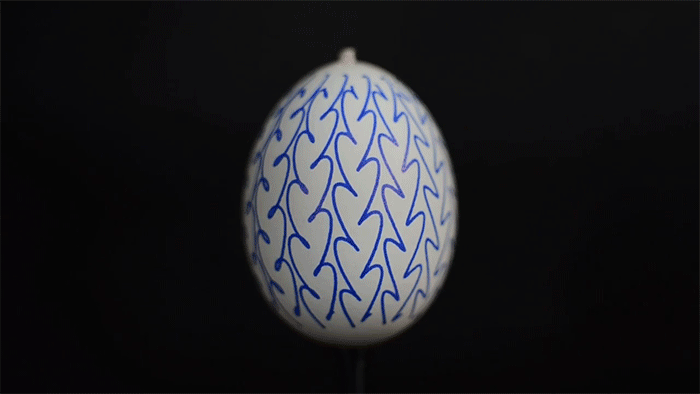

[3D printed zoetrope](http://www.thisiscolossal.com/2016/06/a-fascinating-3d-printed-light-based-zoetrope-by-akinori-goto/) by Akinori Goto: 
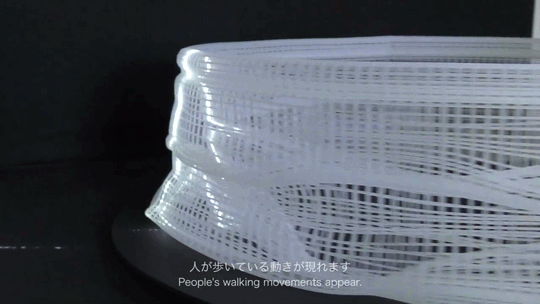

John Edmark creates "[Blooms](https://vimeo.com/198150547)", computer-modeled and 3D-printed sculptures that demonstrate phyllotaxis, similar to the arrangements of many plant parts; these are sculptures designed to be observed with a stroboscope or through a well-timed video shutter. 
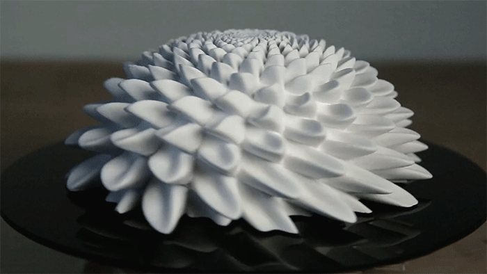

**Additional works of note:**

* Pablo Garcia, [*Profilograph (After Dürer)*](https://vimeo.com/56735804)
* [All Things Fall](https://vimeo.com/125791075) by Mat Collishaw & Sebastian Burdon (*note: violence*)
* NYC subway zoetrope, [MASSTRANSISCOPE](https://www.youtube.com/watch?v=LKpfnYzsDCU)

---

## Loops in Cinema

Loops inform (and are informed by) both cinematic practices and, oftentimes, the musical foundation of *rhythm*.

* Norman Mclaren, [*Canon*](https://www.youtube.com/watch?v=lxNhUswEO7c) (1964)
* Zbigniew Rybczyński, [*Tango*](https://vimeo.com/90339479) (1980)
* Marco Brambilla, [*Civilization*](https://vimeo.com/14837116) (2009)
* Jeff Desom, [*Rear Window Timelapse*](https://vimeo.com/37120554) (2012)

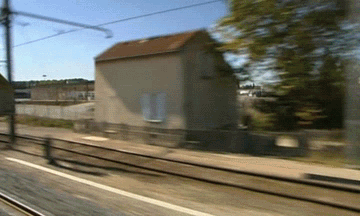 
Michel Gondry + Chemical Brothers, [*Star Guitar*](https://www.youtube.com/watch?v=0S43IwBF0uM)

 
*Loop by [Andreas Wannerstedt](https://andreaswannerstedt.se/pendulums)*

*Cinemagraphs* are an interesting hybrid of video and static photography and a new visual medium in their own right:  
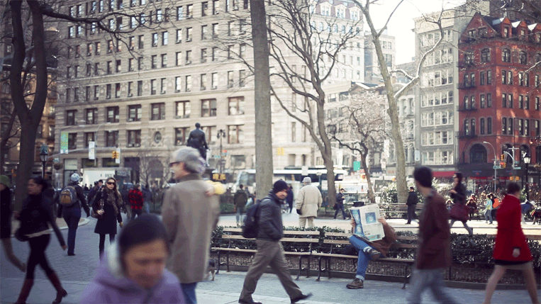

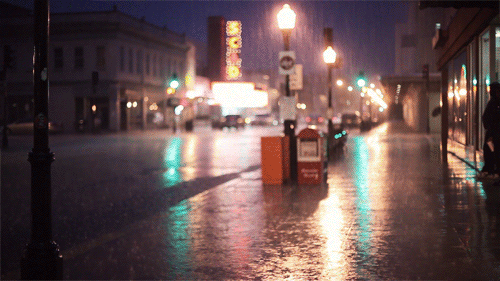

Check out more glossy cinemagraphs [here](http://cinemagraphs.com/).

---

## Computational Art and GIF Loops

There are a burgeoning number of computational artists and designers who are discovering vast and expressive new worlds in the constraints of this durable format for dynamic imaging. 

 
*Loop by David Whyte ([Bees & Bombs](https://beesandbombs.tumblr.com/))*

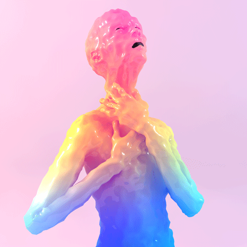 
*Loop by [Kytten Janae](https://www.instagram.com/kyttenjanae/)*

Here’s a list of some leading practitioners; please spend some time with their work:

* [Bees & Bombs](https://beesandbombs.tumblr.com/)
* [DVDP (Davidope)](http://dvdp.tumblr.com/)
* [Cindy Suen](http://cindysuen.tumblr.com/)
* [Étienne Jacob](https://twitter.com/n_disorder)
* [Paolo Čerić](http://patakk.tumblr.com/)
* [Saskia Freeke](https://www.instagram.com/sasj_nl/)
* [Kytten Janae](https://www.instagram.com/kyttenjanae/)
* [89A](http://www.89a.co.uk/)
* [Echophon](http://echophon.tumblr.com/)
* [Aaron Meyers](http://teleaaron.tumblr.com/tagged/loop)
* Rachel Binx and Sha Hwang developed [GIFPop!](https://gifpop.io/collections/artists), an e-commerce system for converting animated gifs into lenticular prints. 

 
*Loop by David Whyte ([Bees & Bombs](https://beesandbombs.tumblr.com/))*