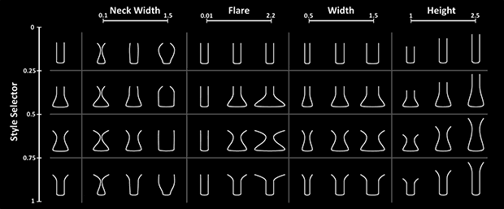
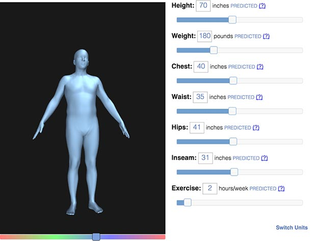
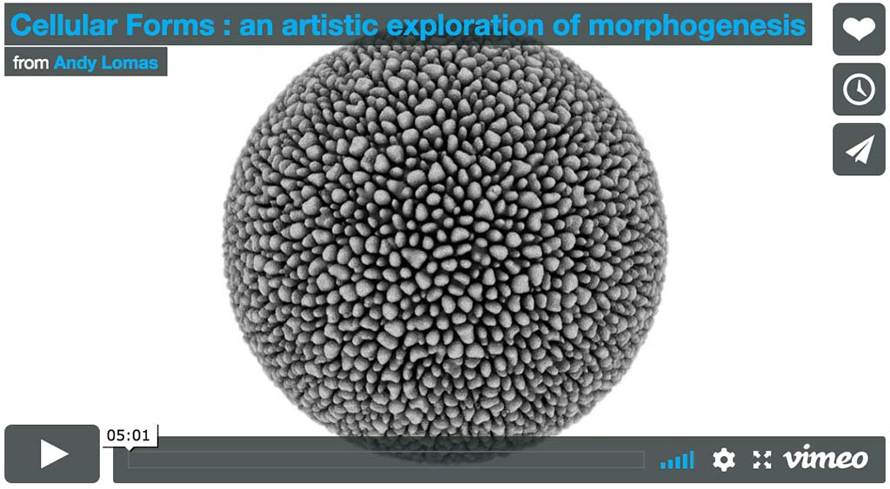

## Manufactory

http://golancourses.net/2015/jmars/05/19/johnmars-ibldi/

ibldi by John Mars is a web app that creates customizable 3D printed models of urban areas.
Using extracted 3D tiles, i.e., buildings, textures, and terrains, from Here.com, ibldi is a webapp that allows users to select custom areas within cities (or anywhere that has 3D data available), and have them printed via Shapeways.

It drew inspiration from two similar apps, Terrafab and The Terrainator — where both of them are focused on terrain, mine is focused instead on buildings.

The 3D prints created with Shapeways are absolutely gorgeous. Printed in full-color sandstone, their bases are 5cm x 5cm (heights obviously vary), and prices range from $10 to $80 depending on the height and density of the buildings.

The application is currently limited to a single zoom-level in New York City, but more areas and zooms will be available soon. Custom selection bounds are also in the works, as well as options to customize the models.

Fahz Face Vase = data, functionality 
Nervous System Kinematic Dress = body + simulation + fab
Lia Filament Sculpture = randomness + params
Csuri = 1966 numeric milling
Ekene = political + data
Amanda Ghassei = 3D Printed Record
J. Eisenman = Parametric Vase diagram
Meshu = personal + fab pipeline
Epler = political + data
Kyle & Lisa Jeans - body + hand fabrication

### Introduction

In this lecture, we’ll look at how algorithmic form and generative gestaltung (“form-making”) are employed in the arts, design, culture, entertainment, and hackery. This lecture is intended to prepare you for an assignment like "Parametric Object" or "Interactive Manufactory". Although 2D parametric form is a venerable mode of inquiry, this lecture is focused on 3D form: not on images or representations, but on *things*.

### Terms.

A *parametric object* is a “meta-form”: a mutable or variable object, produced by a set of rules, whose properties are governed or articulated by the values of certain variables or parameters. Change the values of the variables — and the form changes in response. *Generative design* is the activity of authoring the systems of rules that generate parametric objects. Sometimes designer-developers create a tool that generates forms, and then give that tool to a user; other times, the designer-developer is the sole intended user of her own tool.

The simplest parametric systems just have a set of variables which each control various independent visual properties. [Here’s a schema](http://slides.com/jeisenma/defense#/) by J. Eisenman for a parametric vase, for example, which has independent variables for a vase’s height, width, mouth flare, and neck width. A wide variety of forms are possible, within a well-circumscribed design space. It’s easy to imagine controlling such properties with a UI made of knobs or sliders.

[Here‘s a design system for a parametric human body](http://www.bodyvisualizer.com/male.html) (*Body Visualizer* by Max Planck Gesellschaft). But the sliders are no longer independent; instead, they affect each other in interrelated ways, with complex functional dependencies, as articulated through a sophisticated model of body shape variation. Increase the model’s weight, and their waist circumference, necessarily, must expand.

Artist-researchers interested in organic morphogenesis cannot achieve lifelike forms with explicit control: there is no equation to generate a cat. (Well, actually, [here’s one](http://www.wolframalpha.com/input/?i=cat+curve)). Instead, they use simulations in which millions of discrete elements (like particles) obey systems of simple rules with emergent properties (like flocking behavior). To achieve this, the “control parameters” must shift from first-order controls (width, height, etc.) to second-order controls that regulate the variables in a simulation (such as “cell division rate”, “inter-cell attraction force”, “nutrient density”) that then articulates the form. Andy Lomas explores such rule-generating systems in pure 3D abstractions that are highly organic.

### Early History.

There is a long history of parametric design of 2D and computer-graphic forms. In this section our focus is on parametric 3D objects, and specifically on parametric 3D objects that can (or could) be realized through computer-aided fabrication and direct-digital manufacture.

“Computer-numeric controlled” (CNC) milling machines were first developed in the early 1950s, primarily for military and aviation uses; the first CNC patent [was awarded to MIT in 1952](http://en.wikipedia.org/wiki/History_of_numerical_control#Enter_MIT). As with digital computers, the [first CNC machines](http://makezine.com/2012/04/02/punch-tape-programmable-metal-mill-from-1952/) were extremely expensive, complex, and few. During the Cold War, the United States, fearing the possibility of its Air Force falling behind the Soviet Union’s in a “[bomber gap](http://en.wikipedia.org/wiki/Bomber_gap)“, greatly increased its military spending, and CNC machinery proliferated. Soon after this, and only shortly after the [birth of 2D computer arts in 1965](http://en.wikipedia.org/wiki/Computer_art#History), the earliest non-utilitarian use of a computer controlled milling machine was by the computer-arts pioneer Charles (Chuck) Csuri, in his *Numeric Milling* sculptures (1966-1970).

> *Csuri’s wooden sculpture Numeric Milling is one of the few early computer sculptures created with a computer-driven milling machine… This work made use of the Bessel function to generate the surface. The computer program then generated a punched tape to represent the coordinate data. Included were instructions to a 3-axis, continuous path, numerically controlled milling machine.*

In parallel with the development of CNC was the development of CAD, or techniques for describing forms through equations and algorithms. The Bezier Curve, for example, was ‘invented’ in 1959.

http://www.salavon.com/work/FormStudy1/

---

### Some Scriptable Online Manufacturers (2019) 

Here are some online business services that perform digital fabrication-on-demand, and provide an API for scriptable commerce.

* [Spoonflower](https://www.spoonflower.com/) - fabric, wallpaper, giftwrap ([API](https://api.spoonflower.com/))
* [Shapeways](https://www.shapeways.com/) - 3D prints ([API](https://developers.shapeways.com/))
* [Ponoko](https://make.ponoko.com/) - Lasercutting ([API](http://www.ponoko.com/app-gateway/api-documentation))
* [Zazzle]() - Custom mugs, rugs, pens, jewelry, etc. ([API](https://www.zazzle.com/sell/developers))
* [Scalable Press](https://scalablepress.com/) - T-shirts ([API](https://scalablepress.com/api))
* [Blurb](http://www.blurb.com/) - Books ([API](http://www.blurb.com/print-api-software))

